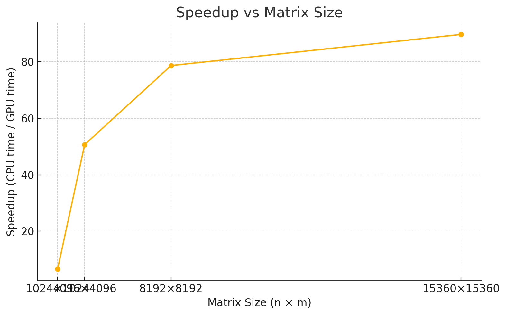

# Task 3 – Performance Improvement (CUDA)

## 📌 Description

This task evaluates and improves the performance of a CUDA-based 2D heat propagation simulation.  
The goal is to measure and compare execution times of CPU and GPU implementations under different configurations, focusing on:

- Grid/block size selection
- Shared memory optimization
- Speedup analysis
- Numerical accuracy

## 🚀 Optimization Strategy

- **Shared memory** is used in the `row_avg_kernel` for per-row average reduction.
- **Thread block tuning**: Multiple (x, y) thread configurations are tested (e.g., 16×16, 32×8, 64×4, etc.).
- CPU and GPU versions run on the same input data to ensure fair comparison.
- CUDA Events are used to measure GPU timing (H2D, kernel, D2H, total).
- A mismatch checker validates GPU correctness.

## ⚙️ Build Instructions

```bash
make
```

This compiles the following files:

- `main.cpp` — driver and comparison logic
- `heat_utils.cpp/.h` — CPU simulation, comparison utilities
- `heat_kernel.cu` — CUDA kernels

## ▶️ Usage

```
./task3 -n <rows> -m <cols> -p <steps> [-a <stop_avg>] [-c] [-t]
```

| Option | Description                                    |
| ------ | ---------------------------------------------- |
| `-n`   | Number of rows (e.g., 4096, 8192, 15360, etc.) |
| `-m`   | Number of columns                              |
| `-p`   | Number of simulation steps (e.g., 1000)        |
| `-a`   | Enable early-stop if row avg ≥ value           |
| `-c`   | Disable CPU execution (GPU only)               |
| `-t`   | Enable timing output and speedup calculation   |

## 📊 Block Size Experiments

Tested multiple block sizes to find the best performance:

| Block Size (x×y) | GPU Time (ms) | Observations       |
| ---------------- | ------------- | ------------------ |
| 16×16            | ~5900         | Baseline           |
| 32×32            | ~7800         | Slower (too large) |
| 32×8             | ~4500         | ✅ Good balance     |
| 64×4             | **~4400**     | ✅✅ Best overall    |
| 128×2            | ~5000+        | Slower             |
| 1×256            | ~46000        | ❌ Very inefficient |

Optimal configuration used for final tests: **`dim3(64, 4)`**

## 🧪 Accuracy & Speedup Results

Fixed block size to 64×4, tested different grid sizes (p=1000):

| Grid Size     | CPU Time (ms) | GPU Time (ms) | Speedup | Max Matrix Diff |
| ------------- | ------------- | ------------- | ------- | --------------- |
| 1024 × 1024   | 2038.46       | 30.65         | 66.49x  | ✅ `6.5e-6`      |
| 4096 × 4096   | 32770.7       | 360.60        | 90.85x  | ✅ `6.3e-6`      |
| 8192 × 8192   | 130949        | 1365.46       | 95.9x   | ✅ `4.8e-5`      |
| 15360 × 15360 | 460586        | 4840.13       | 95.15x  | ✅ `6.5e-5`      |



✅ All tests passed numerical threshold of `1e-4`.
🚫 Avoid early-stopping when comparing CPU-GPU results.

## 🧠 Insights

- Shared memory significantly improves per-row reduction time.
- GPU performance scales almost linearly with problem size.
- Optimal thread block size for our case: **64×4**
- Speedups reach over **90x** compared to CPU on large grids.