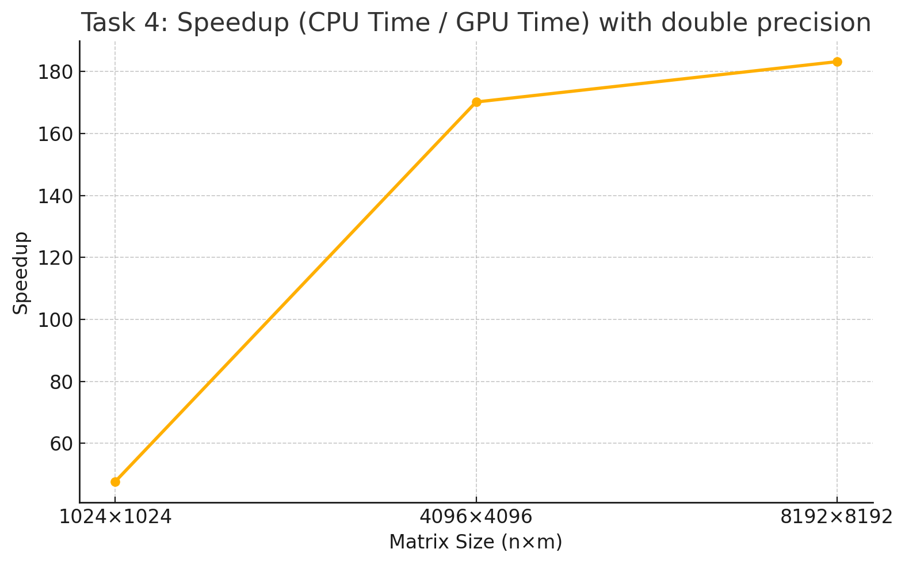

# ✅ Task 4 – Double Precision + Thread Config Test

## 📌 Objective

In Task 4, we were asked to test the same heat diffusion CUDA simulation but using **double-precision floating point numbers** instead of float. We also explored how different thread block configurations affect performance, particularly for a large matrix size (n = m = 15360, p = 1000).

------

## 🔧 Implementation

- All floating-point computations were converted from `float` to `double`, including device arrays, kernels, and memory copies.
- All `f` suffixes in constants (e.g., `0.0f`) were removed or replaced by proper double values (e.g., `0.0`).
- The `row_avg_kernel` was also updated to work with `double`, including shared memory reductions.
- All changes were performed globally using search-and-replace, carefully avoiding type mismatches.

------

## 🧪 Thread Block Configuration Test

We tested a variety of `dim3 blkProp(x, y)` values to observe their impact on performance for the large matrix (15360 × 15360):

| Block Size  | Propagation Time (ms) | Total Time (ms) | Speed Ranking |
| ----------- | --------------------- | --------------- | ------------- |
| 16 × 16     | 19563.34              | 20169.84        | ❌ Slowest     |
| **32 × 32** | **18740.76**          | **19343.87**    | ✅ Fastest     |
| 32 × 8      | 18773.47              | 19381.04        | ✅ Fast        |
| 64 × 4      | 18849.93              | 19453.64        | ✅ Fast        |
| 128 × 2     | 18840.42              | 19440.39        | ✅ Fast        |
| 1 × 256     | 48921.39              | 49528.86        | ❌ Very Slow   |
| 8 × 64      | 18931.14              | 19531.97        | ⚠️ Moderate    |
| 64 × 1      | 18856.19              | 19458.42        | ✅ Fast        |

> ✅ We selected `dim3(32, 32)` as the optimal configuration for all subsequent precision/speedup experiments.

------

## ✅ Accuracy Verification

We compared the double-precision GPU results with the CPU implementation. Below are the outcomes for different sizes:

- **Max matrix diff**: all values ≤ `1e-7`, passing our precision check.
- **Max avg diff**: `0` in all tests.
- No mismatches were detected above the threshold `0.0001`.

------

## 🚀 Speedups (vs CPU, using `dim3(32, 32)`)

| Size      | CPU Time (ms) | GPU Time (ms) | Speedup |
| --------- | ------------- | ------------- | ------- |
| 1024×1024 | 19993.2       | 129.5         | ~47×    |
| 4096×4096 | 319558        | 1599.2        | ~170×   |
| 8192×8192 | 1453440       | 7567.5        | ~183×   |

------

## 📂 Files

- `main.cpp`: driver with flags `-n`, `-m`, `-p`, `-a`, `-c`, `-t`
- `heat_kernel.cu`: CUDA kernel with double precision
- `heat_utils.cpp/h`: shared utilities for CPU & comparison
- `Makefile`: builds `task4` executable

------

## 🧠 Notes

- Double-precision simulations are naturally slower due to hardware constraints.
- Despite longer runtime, GPU still achieves **~180x speedup** compared to CPU on large matrices.
- We maintained numerical correctness across all tested sizes.